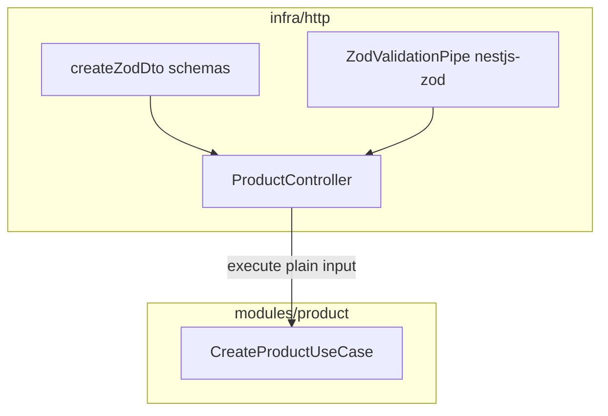

# Plano: migração de Zod manual para nestjs-zod (Clean Architecture / SOLID)

## Contexto atual

- Validação Zod do produto: [`src/infra/http/pipes/zod-validation.pipe.ts`](src/infra/http/pipes/zod-validation.pipe.ts) + schemas em [`src/infra/http/modules/product/schemas/product.schemas.ts`](src/infra/http/modules/product/schemas/product.schemas.ts) + uso inline no [`product.controller.ts`](src/infra/http/modules/product/product.controller.ts).
- **`ValidationPipe` global** em [`src/main.ts`](src/main.ts) com `whitelist`, `forbidNonWhitelisted`, `transform` para rotas com **class-validator** ([`user.controller.ts`](src/infra/http/modules/user/user.controller.ts), [`categoryProduct.controller.ts`](src/infra/http/modules/categoryProduct/categoryProduct.controller.ts), [`profile.controller.ts`](src/infra/http/modules/profile/profile.controller.ts)).
- Filtro [`DomainExceptionFilter`](src/infra/http/errors/DomainExcepionFilter.ts) já repassa `HttpException` (adequado se `ZodValidationException` do `nestjs-zod` for subclasse de `HttpException` — confirmar na versão instalada).

## Princípios (CA + SOLID)

| Princípio | Como aplicar nesta migração |
|-----------|------------------------------|
| **Camadas** | `nestjs-zod`, `createZodDto` e `ZodValidationPipe` ficam só em **`src/infra/http/**`**. Casos de uso em [`src/modules/product/useCases/`](src/modules/product/useCases/) continuam recebendo objetos simples (`string`, `boolean`, …), sem import do pacote. |
| **S / I** | Controller só valida entrada HTTP e delega ao use case com contrato mínimo (já é o caso). |
| **D** | Domínio/aplicação continuam dependendo de abstrações (`ProductRepository`), não de Nest/Zod. |

## Passo 1 — Dependência e checagem de versão

- Instalar **`nestjs-zod`** e garantir peer **`zod`** compatível (projeto já usa Zod 4.x).
- Rodar **`npm run build`** após instalar; se houver erro de peer dependency com Nest 11, ajustar versão do `nestjs-zod` conforme changelog/README do pacote.

## Passo 2 — Coexistência com class-validator (crítico)

Ao passar de **`z.infer` + pipe inline** para **`createZodDto` (classe concreta)**, o parâmetro `@Body()` deixa de ser um “tipo apagado” e passa a ter **metatype de classe**. O **`ValidationPipe` global com `whitelist: true`** tende a **remover propriedades sem decorators do class-validator** antes do pipe Zod — risco de body “vazio” na validação Zod.

**Estratégia recomendada (explícita e previsível):**

1. **Remover** o `app.useGlobalPipes(ValidationPipe(...))` de [`main.ts`](src/main.ts).
2. Adicionar **`@UsePipes(new ValidationPipe({ whitelist: true, forbidNonWhitelisted: true, transform: true }))` no nível do controller** (ou por rota, se preferir granularidade) em:
   - [`user.controller.ts`](src/infra/http/modules/user/user.controller.ts)
   - [`categoryProduct.controller.ts`](src/infra/http/modules/categoryProduct/categoryProduct.controller.ts)
   - [`profile.controller.ts`](src/infra/http/modules/profile/profile.controller.ts)

Assim, rotas **class-validator** continuam protegidas; rotas **nestjs-zod** (produto) não passam por esse whitelist acidentalmente.

**Alternativa** (se quiser manter um único pipe global): registrar apenas um dos dois globais e validar com testes manuais/automáticos todas as rotas — é mais frágil neste estado misto; por isso a recomendação acima é escopar o `ValidationPipe`.

## Passo 3 — Modelar produto com `createZodDto`

- Manter os **`z.object(...)`** em [`product.schemas.ts`](src/infra/http/modules/product/schemas/product.schemas.ts) como fonte única da forma dos dados HTTP.
- Ao lado (mesmo arquivo ou `product.dto.ts` em `infra/http/modules/product/`), declarar classes:

  - `CreateProductBodyDto extends createZodDto(createProductBodySchema)`
  - `UpdateProductBodyDto extends createZodDto(updateProductBodySchema)`
  - `UpdateProductParamsDto extends createZodDto(updateProductParamsSchema)` (schema já é `{ id: uuid }` — compatível com `@Param()` objeto Nest)

- Tipagem no controller: usar essas classes em `@Body()` / `@Param()` e continuar chamando `execute` com o mesmo shape de objeto que hoje (plain fields).

## Passo 4 — `ZodValidationPipe` do nestjs-zod

- Em [`product.controller.ts`](src/infra/http/modules/product/product.controller.ts): importar **`ZodValidationPipe` de `nestjs-zod`** (não do arquivo local).
- Aplicar **`@UsePipes(ZodValidationPipe)` no `@Controller('product')`** (nível controller cobre body + params das rotas PATCH/POST).
- Remover imports/uso do pipe customizado e dos schemas apenas como tipos `z.infer` onde forem substituídos pelos DTOs gerados.

## Passo 5 — Remover código morto

- Apagar [`src/infra/http/pipes/zod-validation.pipe.ts`](src/infra/http/pipes/zod-validation.pipe.ts) se não houver outros consumidores (`grep` no repo).

## Passo 6 — Contrato de erro HTTP (opcional mas recomendado)

- `nestjs-zod` usa **`ZodValidationException`** com formato de erro tipicamente distinto do atual (`flatten()` no `BadRequestException`).
- **Decisão de produto:** aceitar o formato nativo da lib **ou** estender/filtrar no [`DomainExceptionFilter`](src/infra/http/errors/DomainExcepionFilter.ts) com `@Catch(ZodValidationException)` **antes** do ramo genérico `HttpException`, mapeando para o mesmo JSON que o frontend já espera (ex. `errors` flatten ou lista unificada).

Sem esse passo explícito, clientes podem ver mudança na estrutura do 400 nas rotas de produto.

## Passo 7 — Verificação

- `npm run build`.
- Testes manuais: POST `/product` válido/inválido; PATCH `/product/:id` body vazio (deve seguir regra atual do domínio [`NoFieldsToUpdateError`](src/domain/errors/NoFieldsToUpdateError)); rotas user/category/profile com campo extra no body (deve falhar com `forbidNonWhitelisted` como hoje).

## Fase 2 (fora do escopo mínimo, alinhada ao mesmo desenho)

- Migrar gradualmente user/profile/category para `createZodDto`, remover `class-validator` desses módulos e então registrar **`ZodValidationPipe` uma vez** (ex. `APP_PIPE` em [`app.module.ts`](src/app.module.ts)) **sem** `strictSchemaDeclaration` até todas as entradas HTTP estiverem cobertas por Zod DTO — evita `ZodSchemaDeclarationException` em desenvolvimento.

## O que não fazer nesta migração (para manter foco)

- Não adicionar **`ZodSerializerInterceptor`** / `@ZodResponse` globalmente sem necessidade (aumenta superfície e exige tratamento de `ZodSerializationException`).
- Não importar `nestjs-zod` em [`src/modules/`](src/modules/) ou [`src/domain/`](src/domain/).
